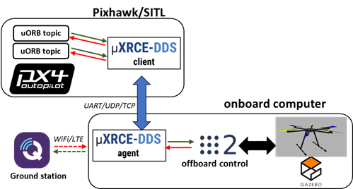
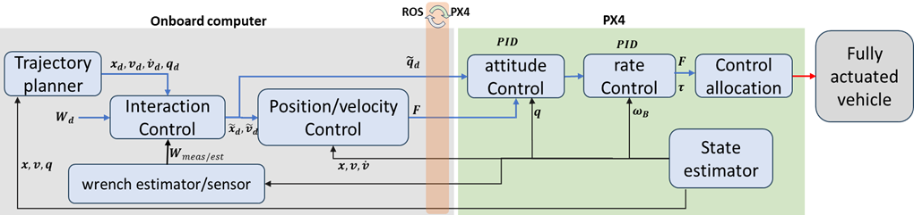
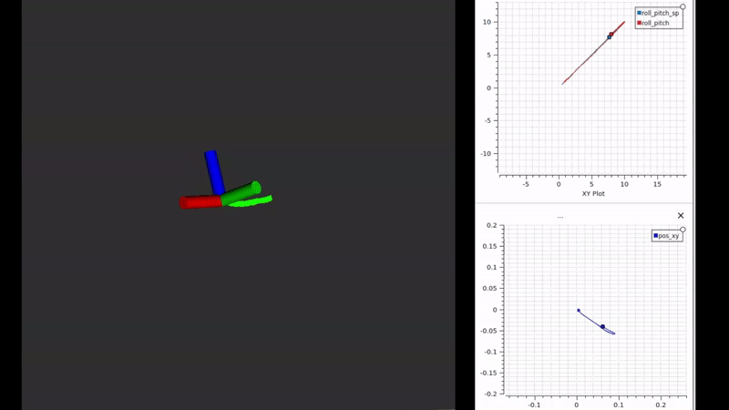

# fully-actuated aerial manipulator using PX4 and ROS2

The objective of this work is to accelerate the development of fully-actuated aerial manipulators by utilizing existing open source PX4 and ROS2. This repository presents a proposed system architecture and examples of how to use PX4 and ROS2 to model and control a fully actuated aerial platform.

## Introduction
 the proposed system architecture is shown below. This is a typical PX4+ROS2 system architecture that allows both simulation and physical experiments using the same code.



The general control architecture is shown below. To achieve 6D control with minimal efforts, PX4 offboard control is used to command attitude (eventually converted to torque vector by rate controller in PX4) and thrust (body thrust vector is passed through to control allocation module). The 6D wrench command is transformed into rotor angular velocities using the control allocator. We only need to provide our custom frame geometry and the control allocator will do the rest. If the rotors are actively titled by servos then the control allocator code will need to be modified or we can perform control allocation in ROS2 node and publish thrust+torque commands directly to PX4.



## Samples:

- **Fully actuated pose control**

   A hexarotor achieves full actuation by tilting the rotors 30 degrees around their arms. The custom frame is simulated using Gazebo classic. ROS2 offboard controller provides 6D motion control. the drone is commanded to follow a helix trajectory while maintaining flat attitude.

   

- **Fully actuated attitude control**

   We can also control attitude while mainlining position. Below is example of tracking a 10 degrees sinusoidal trajectory for roll/pitch/yaw.
   


- **Fully actuated vs underactuated velocity control**
   
   Below is velocity control using fully actuated and under-actuated controllers. The platform is the same for both cases. Better performance can be achieved with further controller tuning.
   
   

- **admittance interaction control**

   Using fully actuated controller to perform push and slide interaction task. The interaction force is regulated using admittance controller. The code for this example is not yet released.
   


### Directory organization
``` 
├── PX4-Autopilot >> contains px4 autopilot
├── README.md  >> this file
├── media   >> contains detailed guides, images and videos
├── microros_ws >> conatins code of DDS middleware agent
├── px4_changes >> custom px4 airframes and configurations
├── ros2_code >> ROS2 colcon workspace
└── scripts  >> helpful bash scripts
```

### Requirements
   * Install [ROS2](https://docs.px4.io/main/en/ros/ros2_comm.html#install-ros-2), setup with Gazebo
   * Install [QGroundControl](https://docs.qgroundcontrol.com/master/en/qgc-user-guide/getting_started/download_and_install.html#ubuntu)
   * install [PlotJuggler](https://github.com/facontidavide/PlotJuggler) for plotting
   * Build [PX4-Autopilot](https://docs.px4.io/main/en/dev_setup/building_px4.html) from source. Instructions below


Tested with
   * Ubuntu: 20.04
   * ROS2: foxy with Gazebo 11 (classic)
   * Python 3.8
   * PX4-Autopilot version 1.15 
   
## Citation
Please cite the [following paper](https://ieeexplore.ieee.org/abstract/document/10652521) when using this work:

```bibtex
@INPROCEEDINGS{10652521,
  author={Alqutami, Tareq Aziz Hasan and Dunnigan, Matthew W. and Petillot, Yvan},
  booktitle={2024 9th International Conference on Mechatronics Engineering (ICOM)}, 
  title={Modeling and Motion Control of a Fully Actuated Multirotor for Aerial Manipulation Using PX4 and ROS2}, 
  year={2024},
  volume={},
  number={},
  pages={396-401},
  doi={10.1109/ICOM61675.2024.10652521}
}
```

## Instructions
1. [Building PX4 and incorporating custom fully-actuated frames](media/px4_autopilot_setup.md)
2. [Building and running the DDS middleware (uXRCE-DDS)](media/uxrce_dds_setup.md)
3. [Building ROS2 workspace](media/ros2_workspace_setup.md)
4. [Explore the code](ros2_code/src/px4_offboard_ros2/README.md)

## Run PX4 offboard control (underactuated and fully actuated)
We will show step-by-step guide to run an offboard control simulation. This assumes previous instructions to install required dependencies have been completed.

We will need 5 terminals to run the following
   * uxrce-dds agent
   * PX4 Gazebo SITL
   * QGroundControl (optional)
   * visualization (Rviz and plotjuggler)
   * px4 offboard control

In each terminal, we will first source the workspace settings and  set `ROS_DOMAIN_ID` and `PYTHONOPTIMIZE`. We assume that we are starting from the main directory of this repository.

### 1. Run the uxrce-dds agent

In the first terminal run the following
```bash
cd microros_ws
source ../scripts/start_microros_px4.bash
```

### 2. Run PX4 Gazebo SITL

In the second terminal run PX4 SITL and specify the desired model
```bash
cd PX4-Autopilot
source ../scripts/px4_ros2.bash
VERBOSE=1 VERBOSE_SIM=1 HEADLESS=1  make px4_sitl gazebo-classic_tilted_hex
```

Gazebo should start and spawn the model in headless mode. You should also see some logs about the creation of `uxrce_dds_client` topics. 
Similarly, you will see in the first terminal (`uxrce-dds agent`) logs on topics/publishers/datawriters creations.

### 3. Start QGroundControl 

In the third terminal, launch the `QGroundControl` app:
```bash
cd `<dir of QGroundControl.AppImage>`
./QGroundControl.AppImage
```

The offboard control code doesn't handle taking off.
You will need to takeoff either from QgroundControl or using PX4 commander.

in QGroundControl, click `Takeoff` from left hand menu, then slide to confirm

The simulated drone should takeoff. 
Switch to offboard mode after running the offboard control code. This can be done using rqt_reconfigure or using QGroundControl.

### 4. Start the visualization nodes
First ensure that data is coming to ROS2 from PX4.

In the fourth terminal (ROS2), run the following:
```bash
cd ros2_code
source ../scripts/source_ros2.bash
source install/setup.bash
ros2 topic list
```

You should see a list of topics that match the ones sent from PX4.:

```
.
.
/fmu/in/actuator_motors
/fmu/in/actuator_servos
/fmu/in/arming_check_reply
/fmu/in/aux_global_position
/fmu/in/config_control_setpoints
/fmu/in/config_overrides_request
/fmu/in/differential_drive_setpoint
/fmu/in/goto_setpoint
/fmu/in/manual_control_input
.
.
```

If you do not see the topics:

  * Check that `ROS_DOMAIN_ID=0` is set in all the terminals
  * micro-ros agent is running and all topics were created by the agent.

you can try to echo a topic to confirm data is coming to ROS2:

```bash
ros2 topic echo /fmu/out/vehicle_odometry
```

After verifying DDS-ROS2 communication is good, we can run the visualization launch file
``` bash
ros2 launch px4_offboard_ros2 visualize.launch.py
```
This will start rviz,px4 visualizer node,  plotjuggler, and rqt_reconfigure.You can load a predefined plotjuggler layout from `plotjuggler_layouts` folder. You should do this after running all ros nodes so that all topics are already defined.

### 5. Start the px4 offboard controller
run the controller launch file. There are multiple controllers implemented which are detailed in the package readme [here](ros2_code/src/px4_offboard_ros2/README.md).

For example to run the position control:

```bash
cd ros2_code
source ../scripts/source_ros2.bash
source install/setup.bash
ros2 launch px4_offboard_ros2 pose_control.launch.py
```

If all is ok, you should see an rviz interactive marker to command the desired pose and publish it.

In velocity control, you will have rqt_publisher gui, you will need to publish
 - 'Twist' message to `/target_twist` to command the x,y,z linear velocity.
 - Vector3 message to topic `/target_att_rpy` to command the desired attitude in rpy (degrees)


Now go back to QGroundControl and enable the offboard control.  Click the current mode "HOLD" in upper left, then in the menu, select `Offboard`. You could also use `rqt_reconfigure` to enable offbaord control by ticking `engage_px4_offbaord_mode` parameter.

The offboard controller should take over and you can start commanding the drone by dragging the interactive marker in Rviz and publishing the target pose. The transition from px4 controller to offboard controller may not be smooth depending on controller tuning and current setpoint.

You can now load a plotjuggler layout to visualize the trends.


The control gains and some other parameters can by dynamically changed using the dynamic reconfigure rqt gui.

- Fully actuated pose control

- Under-actuated velocity control


## Notes:
- Depending on the drone model selected, hover thrust [0-1] must be updated in the offboard controller. A typically value is 0.5. The code tries to update the hover thrust by subscribing to the hover thrust estimator in px4, however the DDS topic for it has to be added manually in PX4 firmware following the instructions in `px4_changes` directory.
- To visualize the plots in PlotJuggler, you can import the the provided layouts.
- Changing drone model will require retuning the offboard controller.

## TODO
- [ ] Rewrite and optimize the px4_transforms.py .
- [ ] System identification to identify the drone dynamics parameters.
- [ ] conversion between normalized and actual units for thrusts/torques.
- [ ] Implement dynamics-based control.
- [ ] Add interaction control.
- [ ] Include ore fully actuated designs
- [ ] Results using physical platforms
- [ ] Add controller safety checks such as limiting horizontal thrust.
