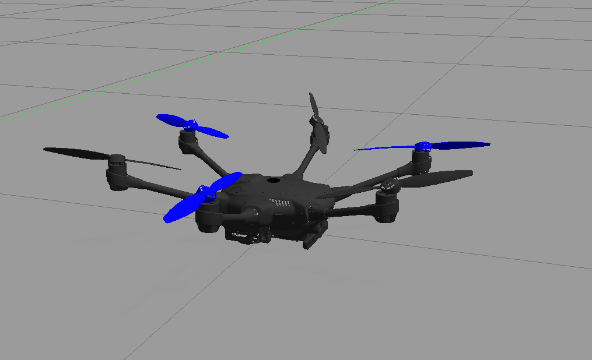

# PX4 Autopilot setup
We need to build PX4 from source and include our custom changes such as custom fully actuated frames.

1. clone px4 firmware to PX4-Autopilot
   ```bash
   git clone https://github.com/PX4/PX4-Autopilot.git --recursive PX4-Autopilot
   ```
2. checkout v1.15
   ```bash
   cd PX4-Autopilot
   git checkout release/1.15
   make submodulesclean
   ```
3. You can clean build the environment at any point if you face issues or want to checkout another branch
   ```bash
   make clean
   make distclean
   ```
4. Build and test gazebo sitl
   ```bash
   make px4_sitl gazebo-classic
   ```
   Once you confirm PX4 SITL works, you can add custom frames.
5. Add the custom PX4 models and configurations in `px4_changes` directory following the readme [px4_changes/README.md](../px4_changes/README.md)

6. clean and build again to include the new models
   ```bash
   make clean
   make px4_sitl gazebo-classic_tilted_hex_arm
   ```
7. run STIL with any of the custom models and enable verbose messages using
   ```bash
   VERBOSE=1 VERBOSE_SIM=1  make px4_sitl gazebo-classic_tilted_hex
   ```
   You may run in headless mode by adding `HEADLESS=1`


