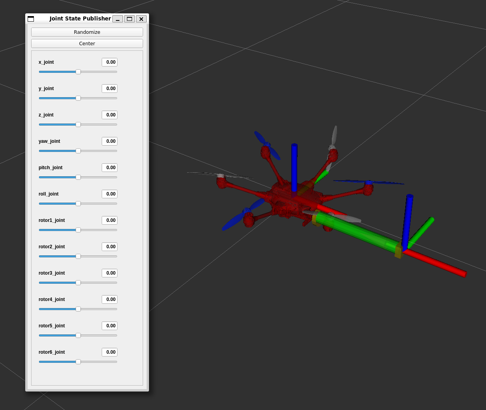

# ROS2 workspace setup

1. download dependencies (px4_msgs and traj_gen):
   - **px4_msgs** : checkout the right version. For px4 v1.15, main branch of px4_msgs throws serialization errors and there is no branch in px4_msgs for px4 v1.15. We checkout a specific commit instead.
      ```bash
      cd ros2_code
      git clone https://github.com/PX4/px4_msgs.git src/px4_msgs
      cd src/px4_msgs
      git checkout bd9dc0fae0162960a31af8f232a9e9f85522ae73
      cd ../..
      ```
   - **traj_gen** (optional): used to generate desired trajectory to be executed by the UAV
      ```bash
      cd ros2_code
      git clone https://github.com/TareqAlqutami/traj_gen.git src/traj_gen
      ```
2. source ROS2

   You can use a script to source ros2. We already have one script to source foxy:
   ``` bash
   source ../scripts/source_ros2.bash
   ```

3. Build `ros2_code` colcon workspace

   Add the `symlink-install` flag to allow us to modify the python code and rerun without the need to rebuild
   ```bash
   colcon build --symlink-install
   ```
   You may see some warnings. But  as long as there are no *errors* it should be OK.

4. Test the code by launching rviz visualization of robot urdf
   ```bash
   source install/setup.bash
   ros2 launch am_description display.launch.py
   ```
   
   you can specify the urdf model using `urdf_model`. Note that you will need to provide complete path such as
   ```bash
   ros2 launch am_description display.launch.py urdf_model:=src/am_description/urdf/tilted_hex_arm.urdf   
   ```


5. Explore using kinematics with KDL library in [am_description/scripts/kdl_testing.ipynb](../ros2_code/src/am_description/scripts/kdl_testing.ipynb)

6. More details of each ROS2 package and nodes within is found in the ros2 workspace readme [here](../ros2_code/src/px4_offboard_ros2/README.md). Running full SITL simulation with offboard control is described there.
