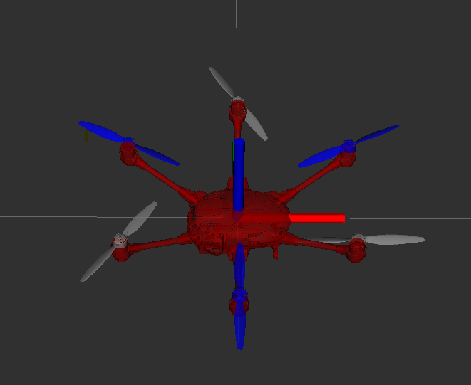
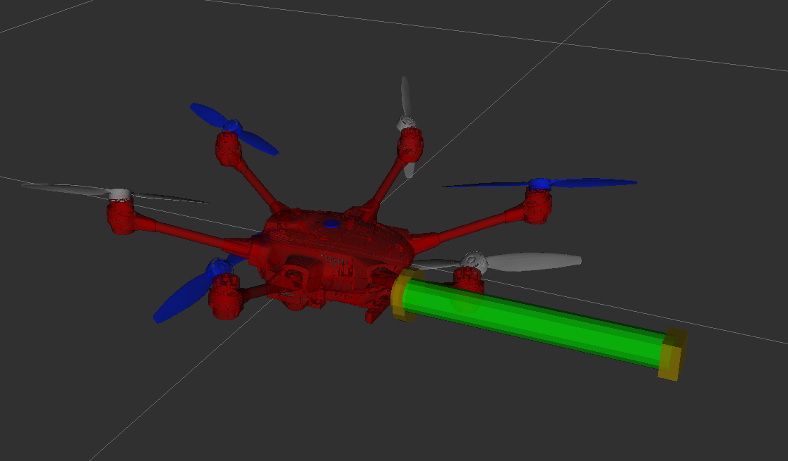

# Aerial Manipulator Description package

This package contains robot description of the aerial robots in URDF format and visualization facility in ROS2.
There is python notebook to explore robot kinematics using KDL and URDF.
This package should provide robot description/kinematics to other packages that perform dynamics and control.

## Requirements
Tested with ROS2 foxy (Ubuntu 20.04) and KDL>v1.4 (built from source)


## Robots
1. `hex_x.urdf`: under-actuated hexarotor (x-configuration)
2. `tilted_hex.urdf`: fully-actuated hexarotor (x-configuration) with fixed tilt propellers. tilt angle:30 degrees
3. `tilted_hex_arm.urdf`: fully-actuated hexarotor with fixed arm manipulator and F/T sensor. propeller tilt angle:30 degrees
4. `t960_flat.urdf`: under-actuated hexarotor (x-configuration) with 960mm wheelbase. This is quite similar to hex_x but larger.
5. `f960_tilt30.urdf`: fully-actuated hexarotor with 960mm wheelbase and rotors tilted by 30degrees around their arms.

# How to run
launching rviz visualization of robot urdf
```bash
ros2 launch am_description display.launch.py
```

   
you can specify the urdf model using `urdf_model`. Note that you will need to provide complete path such as
```bash
ros2 launch am_description display.launch.py urdf_model:=src/am_description/urdf/tilted_hex_arm.urdf   
```



### Kinematics and dynamics
Explore using kinematics/dynamics with KDL library in `am_description/scripts/kdl_testing.ipynb`


