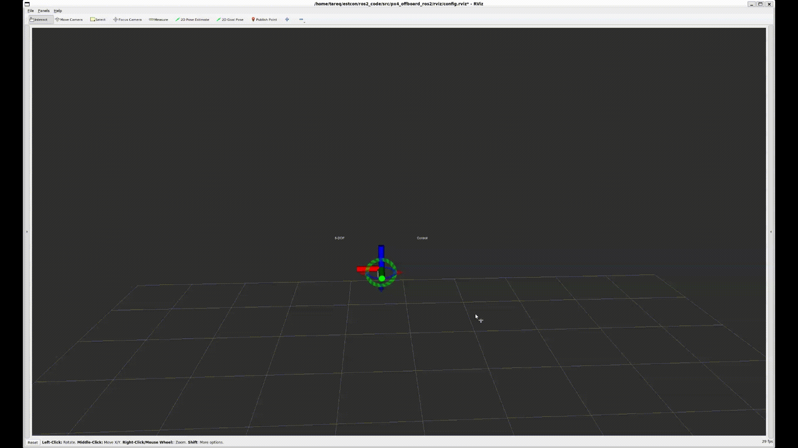

## Overview

PX4 Offboard control using ROS2.

### Requirements
   * Ubuntu: 20.04
   * Python 3.8
   * PX4 version 1.15

## Description

### Python files
The offboard control package contains the following python scripts.

| file | description |
| :----: | :---: | 
| `pose_control_node.py`      | implements position controller for underactuated vehicles. It transforms position+yaw setpoints into attitude and thrust (Z-axis) commands     | 
| `fa_pose_control_node.py`      | implements pose controller for fully-actuated vehicles. It transforms position setpoint to 3D thrust command and pass an attitude setpoint to PX4 attitude controller   | 
| `vel_control_node.py`      | implements velocity controller (vx,vy,vz) for underactuated vehicles. It transforms velocity into acceleration setpoint then transform it to attitude and thrust commands   | 
| `fa_vel_control_node.py`      | implements  velocity controller (vx,vy,vz) for fully-actuated vehicles. It transforms velocity commands to 3D thrust commands and pass it along with attitude target to PX4 attitude controller    | 
| `PIDn.py`      |  implements n-dimensional PID controller class     | 
| `common.py`      |  helper functions     | 
| `pose_interactive_marker_node.py`      |  ROS2 rviz interactive marker server, used to publish Pose (rot,trans) commands from rviz. This is consumed by the pose controller     | 
| `px4_transforms.py`      |  transforms between PX4 and ROS4 reference frames     | 
| `urdf.py`      |  parses urdf from file and provide KDL related functions (not fully tested)     | 
| `visualizer_node.py`      |  ROS2 node that publishes robot pose and path in rviz     | 
| `traj_generator.py`      |  Implements a trapezoidal velocity profile and ensure bounded accelerations. This is used in velocity controller to condition the velocity setpoints    | 
| `control_sig_generator_node.py`      | generates control signal waveforms to produce repeatable results. Several signals have been hard-coded. Only one signal should be active at a time. |

### Launch files
ros2 launch files description.

| launch file | description |
| :----: | :---: | 
| `visualize.launch.py`      | runs rviz visualization (`visualizer_node.py`) and plotjuggler for plotting |
| `pose_control.launch.py`      | Runs position controller (`pose_control_node.py`) and rviz interactive marker (`pose_interactive_marker_node.py`) to command the drone position| 
| `fa_pose_control.launch.py`   | Runs pose controller (`fa_pose_control_node.py`) and rviz interactive marker (`pose_interactive_marker_node.py`) to command the drone pose| 
| `vel_control.launch.py`      | Runs velocity controller (`vel_control_node.py`) and rqt publisher to command the desired velocity vector| 
| `fa_vel_control.launch.py`      | Runs velocity controller (`fa_vel_control_node.py`) and rqt publisher to command the desired velocity+attitude vectors| 


## Pose control testing
1. Run PX4 SITL for one of the robots (e.g. hex_x, tilted_hex, tilted_hex_arm)
   ```bash
   cd PX4-Autopiot
   source ../scripts/px4_ros2.bash
   VERBOSE=1 VERBOSE_SIM=1 HEADLESS=1  make px4_sitl gazebo-classic_tilted_hex
   ```

2. Run QgroundControl in another terminal
   ```bash
   ./QGroundControl.AppImage
   ```
3. Run micro-ros agent
   ```bash
   cd microros_ws
   source ../scripts/start_microros_px4.bash
   ```

4. takeoff using px4 commander or from QgroundControl.

5. launch rviz and plotjuggler
   ```bash
   cd ros2_code
   source ../scripts/source_ros2.bash
   source install/setup.bash 
   ros2 launch px4_offboard_ros2 visualize.launch.py
   ```

   load the respective plotjuggler layout from file (`px4_offboard_pose.xml` for pose testing). Do this only after running the controller node below so that topics are available.

6. launch pose controller
   ```bash
   cd ros2_code
   source ../scripts/source_ros2.bash
   source install/setup.bash 
   ros2 launch px4_offboard_ros2 fa_pose_control.launch.py
   ```

   you can also use the under-actuated position controller
   ```ros2 launch px4_offboard_ros2 pose_control.launch.py```

7. Switch to offboard mode in QgroundControl or using rqt_reconfigure by ticking `engage_px4_offboard_mode` after running    ```bash ros2 run rqt_reconfigure rqt_reconfigure```.
       
8. Command target pose from rviz marker or use command signal generator
   ```bash
   ros2 run px4_offboard_ros2 cmd_sig_generator
   ```

   Ensure the target signal is appropriate. Uncomment the relevant signal type and waveform in the script `control_sig_generator_node.py`




## Velocity control testing
Run the steps 1-5 from `pose control testing` section above.

6. launch velocity controller
   ```bash
   cd ros2_code
   source ../scripts/source_ros2.bash
   source install/setup.bash 
   ros2 launch px4_offboard_ros2 fa_vel_control.launch.py
   ```

   you can also use the under-actuated velocity controller
   ```    ros2 launch px4_offboard_ros2 vel_control.launch.py```

7. Switch to offboard mode similar to `7.` above.
8. Command target velocity (and attitude for fully-actuated vehicles) using rqt publisher (`/target_twist` and `/target_att_rpy`) or use command signal generator.


below shows under-actuated velocity control
